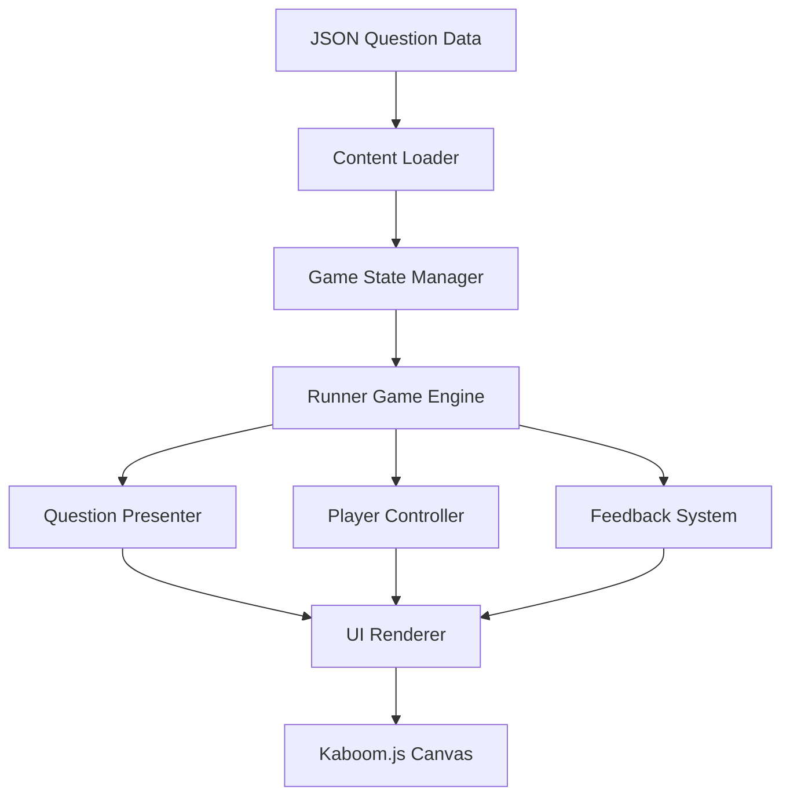

# Design Document

## Overview

The Educational Runner Game is a browser-based educational mini-game built with Kaboom.js that combines simple runner mechanics with JSON-driven educational content. The game follows an "academic first" approach where gameplay serves to reinforce learning through frequent, low-stakes practice opportunities.

The architecture emphasizes modularity, lightweight performance, and easy content customization. Teachers can swap question sets by simply replacing JSON files, while the core game engine handles presentation, interaction, and feedback.

## Architecture

### High-Level Architecture



### Core Systems

1. **Content Management System**: Handles JSON loading, validation, and question queue management
2. **Game Engine**: Manages the runner mechanics, timing, and game loop
3. **Educational System**: Presents questions, processes answers, and provides feedback
4. **Rendering System**: Uses Kaboom.js for all visual elements and animations

## Components and Interfaces

### ContentLoader
```javascript
class ContentLoader {
  async loadQuestions(jsonPath)
  validateQuestionFormat(questions)
  getNextQuestion()
  resetQuestionQueue()
}
```

**Responsibilities:**
- Load and parse JSON question files
- Validate question data structure
- Manage question queue and cycling
- Handle loading errors gracefully

### GameStateManager
```javascript
class GameStateManager {
  currentState // 'menu', 'playing', 'question', 'feedback', 'gameover'
  score
  lives
  questionTimer
  
  setState(newState)
  updateScore(points)
  decrementLives()
  resetGame()
}
```

**Responsibilities:**
- Track current game state and transitions
- Manage score, lives, and timing
- Coordinate between different game phases

### RunnerEngine
```javascript
class RunnerEngine {
  playerSpeed
  obstacleSpeed
  questionInterval
  
  updatePlayer()
  spawnObstacles()
  checkCollisions()
  triggerQuestion()
}
```

**Responsibilities:**
- Handle continuous forward movement
- Manage obstacle/gate spawning
- Trigger question events at appropriate intervals
- Handle basic collision detection

### QuestionPresenter
```javascript
class QuestionPresenter {
  currentQuestion
  answerOptions
  
  displayQuestion(question)
  handleAnswerSelection(selectedOption)
  showFeedback(isCorrect, feedbackText)
}
```

**Responsibilities:**
- Render question UI elements
- Handle answer selection input
- Display immediate feedback
- Manage question-specific animations

## Data Models

### Question Schema
```json
{
  "questions": [
    {
      "id": "unique_identifier",
      "type": "multiple_choice",
      "prompt": "Question text",
      "options": ["Option A", "Option B", "Option C"],
      "answer": "Option A",
      "feedback": "Explanation for correct answer",
      "difficulty": 1,
      "subject": "math",
      "topic": "fractions"
    }
  ],
  "metadata": {
    "title": "Fraction Practice",
    "description": "Basic fraction comparison",
    "version": "1.0",
    "author": "Teacher Name"
  }
}
```

### Game State Schema
```javascript
{
  score: 0,
  lives: 3,
  currentQuestionIndex: 0,
  questionsAnswered: 0,
  correctAnswers: 0,
  gameTime: 0,
  playerPosition: { x: 100, y: 300 },
  gameSpeed: 1.0
}
```

## Error Handling

### JSON Loading Errors
- **Invalid JSON format**: Display user-friendly error message, prevent game start
- **Missing required fields**: Validate schema and show specific field errors
- **Network errors**: Provide retry mechanism and offline fallback

### Runtime Errors
- **Question queue exhaustion**: Cycle back to beginning or show completion message
- **Invalid answer selection**: Ignore invalid inputs, maintain game state
- **Performance issues**: Implement frame rate monitoring and quality adjustment

### User Input Errors
- **Multiple rapid clicks**: Debounce input to prevent double-selection
- **Invalid key presses**: Filter input to only accept valid game controls
- **Touch/mouse outside game area**: Maintain focus on game canvas

## Testing Strategy

### Unit Testing
- **ContentLoader**: Test JSON parsing, validation, and error handling
- **GameStateManager**: Test state transitions and score calculations
- **QuestionPresenter**: Test question display and answer processing

### Integration Testing
- **Game Flow**: Test complete question-answer-feedback cycles
- **JSON Integration**: Test with various question formats and edge cases
- **Performance**: Test with large question sets and extended play sessions

### User Acceptance Testing
- **Educational Effectiveness**: Verify learning objectives are met
- **Usability**: Test with target age groups and skill levels
- **Accessibility**: Ensure keyboard navigation and screen reader compatibility

### Browser Compatibility Testing
- **Modern Browsers**: Chrome, Firefox, Safari, Edge (latest versions)
- **Mobile Browsers**: iOS Safari, Chrome Mobile, Samsung Internet
- **Performance**: Test on various device capabilities and screen sizes

## Technical Specifications

### Kaboom.js Integration
- **Version**: Latest stable (loaded via CDN)
- **Canvas Size**: Responsive, minimum 800x600
- **Frame Rate**: Target 60fps, graceful degradation to 30fps
- **Asset Loading**: Minimal sprites, primarily geometric shapes

### Performance Targets
- **Load Time**: < 3 seconds on 3G connection
- **Memory Usage**: < 50MB total
- **File Size**: < 500KB total (excluding Kaboom.js CDN)
- **Question Processing**: < 100ms per question load

### Browser Requirements
- **JavaScript**: ES6+ support required
- **Canvas**: HTML5 Canvas API support
- **Storage**: LocalStorage for progress saving (optional)
- **Network**: Fetch API for JSON loading

## Deployment Architecture

### Static File Structure
```
/
├── index.html
├── main.js
├── game/
│   ├── content-loader.js
│   ├── game-state.js
│   ├── runner-engine.js
│   └── question-presenter.js
├── data/
│   ├── math-fractions.json
│   ├── vocabulary-basic.json
│   └── science-biology.json
└── assets/
    ├── sounds/ (optional)
    └── images/ (minimal)
```

### Hosting Requirements
- **Static hosting**: GitHub Pages, Netlify, or any web server
- **HTTPS**: Required for modern browser features
- **CORS**: Proper headers for JSON file loading
- **Caching**: Appropriate cache headers for performance